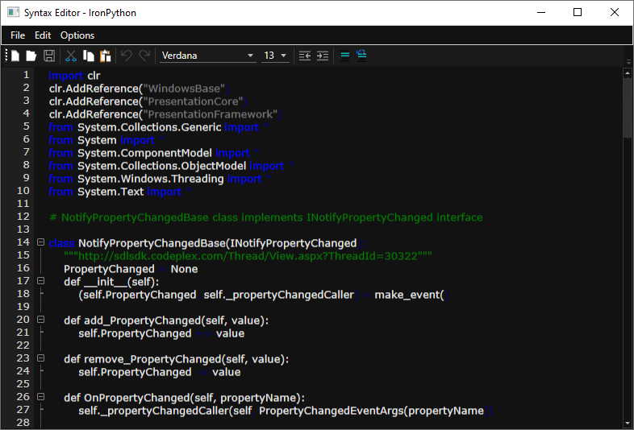

# How to configure custom language using WPF Syntax Editor?

This sample holds the configuration of custom language - IronPython applied and loaded using [Syntax Editor](https://help.syncfusion.com/wpf/syntax-editor/getting-started).

