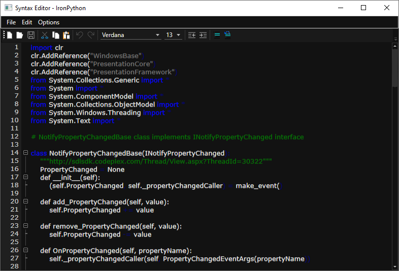

# How to Configure Custom Language Using WPF Syntax Editor?
This repository demonstrates how to configure and apply a custom language definition—specifically IronPython—in the WPF [Syntax Editor](https://help.syncfusion.com/wpf/syntax-editor/getting-started) control provided by Syncfusion. The WPF Syntax Editor is a powerful text editor control that supports syntax highlighting, code editing, and parsing for various programming languages. It is highly customizable and supports defining your own language grammars using XML-based configuration files.

In this sample, we show how to:

- Create a custom language definition file for IronPython.
- Load and apply the custom language to the Syntax Editor at runtime.
- Highlight keywords, comments, strings, and other syntax elements specific to IronPython.
- Integrate the Syntax Editor into a WPF application with minimal setup.

This approach is ideal for developers building code editors, IDEs, or any application that requires syntax-aware text editing. By using custom language configurations, you can tailor the editor to support domain-specific languages or scripting environments.

